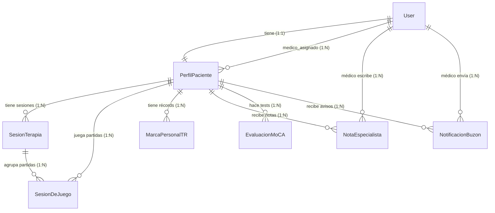

# 🗄️ Arquitectura de la Base de Datos — SamiraDTx

> **Documento 1 de la serie "Documentación de la Página"**
> Este documento explica, con visión general (no línea por línea), **qué entidades existen en la base de datos, qué guarda cada una y cómo se relacionan entre sí**. Es la base para entender todo lo demás (vistas, lógica, juegos, IA…).

---

## 0. Contexto general: ¿qué tecnología hay debajo?

- La web está hecha con **Django** (framework de Python).
- Toda la base de datos se define en **un único archivo**: `core/models.py`.
- Cada **clase** de Python que ves ahí (`class PerfilPaciente`, `class SesionDeJuego`…) se convierte automáticamente en **una tabla** de la base de datos.
- Cada **atributo** de la clase (`edad = models.IntegerField()`) se convierte en una **columna** de esa tabla.
- Django ya trae de fábrica una tabla llamada `User` (usuario del sistema: nombre de usuario, contraseña, email). **Nosotros no la tocamos**, sino que la "extendemos" con nuestras propias tablas.

En total hay **7 tablas propias** + la tabla `User` de Django.

---

## 1. Concepto MÁS IMPORTANTE que debes entender primero

### 👤 No existen "Pacientes" y "Médicos" como tablas separadas

Esto es la clave de todo el diseño. Mucha gente espera ver una tabla `Paciente` y otra tabla `Medico`. **No es así.** El sistema funciona en **dos capas**:

1. **`User`** (de Django) → guarda lo básico para iniciar sesión: usuario, contraseña, email. **Todos** (pacientes y médicos) tienen un `User`.
2. **`PerfilPaciente`** (nuestra) → guarda toda la información médica/personal. **Todos** (pacientes y médicos) tienen también un `PerfilPaciente`.

¿Cómo distinguimos entonces a un médico de un paciente?
Con un simple interruptor (booleano) dentro de `PerfilPaciente`:

```python
es_medico = models.BooleanField(default=False)
```

- Si `es_medico = False` → es un **paciente**.
- Si `es_medico = True` → es un **médico/especialista**.

> 🧠 **Resumen mental:** "Médico" y "Paciente" son el **mismo tipo de usuario**, solo cambia un campo `True/False`. Esto simplifica enormemente el login y la gestión de cuentas.

### 🔗 ¿Cómo se conecta un paciente con su médico?

Dentro de `PerfilPaciente` existe el campo `medico_asignado`, que apunta a un `User` (el del médico). Así, cada paciente "sabe" quién es su médico supervisor, y un médico puede tener muchos pacientes a su cargo.

---

## 2. Las 7 entidades, una por una

### 🟦 Entidad 1 — `PerfilPaciente` (la tabla central)

Es el **corazón del sistema**. Casi todas las demás tablas apuntan a ella. Guarda toda la información de la persona. Sus datos se agrupan así:

| Grupo | Campos clave | Para qué sirve |
|-------|-------------|----------------|
| **Relación con cuenta** | `usuario` (→ User), `es_medico`, `medico_asignado` | Vincular login con perfil y rol |
| **Datos generales** | `lugar_habitual`, `ciudad_residencia`, `anios_estudio` | Contexto del paciente |
| **Datos físicos** | `edad`, `altura`, `peso`, `lado_afectado`, `telefono` | Ficha básica |
| **Datos clínicos (para IA)** | `sexo`, `meses_desde_ictus`, `tipo_ictus` (isquémico/hemorrágico), `hemisferio_afectado`, `hemiparesia_dominante` | Alimentan el modelo de Machine Learning |
| **Estado de evaluación** | `test_completado`, `fecha_ultima_evaluacion` | Saber si ya hizo el test inicial |
| **Niveles de terapia** | `nivel_cognitivo`, `nivel_lenguaje`, `nivel_motor` (1–5), `nivel_asignado` (global, legacy) | Dificultad personalizada por área |
| **Puntuaciones MoCA** | `puntuacion_total_moca` (0–30) + 7 desgloses (`score_visuoespacial`, `score_atencion`, `score_lenguaje`…) | Resultado del test cognitivo guardado en el perfil |
| **Gamificación** | `racha_dias`, `dias_totales`, `puntos_totales`, `tiempo_terapia_hoy` | Motivar al paciente (rachas, puntos) |

**Propiedades calculadas (no son columnas, se calculan al vuelo):**
- `tiene_moca_pendiente` → ¿hay alguna evaluación que el médico aún no ha revisado?
- `notificaciones_sin_leer` → cuántos mensajes tiene sin abrir.

---

### 🟩 Entidad 2 — `SesionTerapia` (sistema VTR, "contenedor")

Representa **una sesión completa de terapia** (cuando el paciente se sienta a entrenar un rato). Es un "paraguas" que agrupa varias partidas.

| Campo | Significado |
|-------|-------------|
| `paciente` | A quién pertenece la sesión |
| `session_id` (UUID) | Identificador único e irrepetible de la sesión |
| `fecha_inicio` / `ultima_actividad` | Cuándo empezó y última señal de vida |
| `vas_inicial` | Cansancio percibido al empezar (escala 1–10) |
| `duracion_minutos` (propiedad) | Duración calculada automáticamente |

> 🎯 **Idea:** una sesión de terapia contiene **muchas partidas** de distintos juegos. Sirve para medir fatiga y rendimiento a lo largo del tiempo (sistema **VTR** = Variabilidad del Tiempo de Reacción).

---

### 🟨 Entidad 3 — `SesionDeJuego` (la partida individual + Wearable)

⚠️ **Ojo con el nombre**: aunque se llama "Sesión de Juego", en realidad representa **UNA partida concreta** de un juego. Es la tabla que más se llena (cada vez que el paciente juega, se crea una fila).

| Grupo | Campos | Para qué |
|-------|--------|----------|
| **Identificación** | `paciente`, `juego`, `fecha`, `nivel_jugado` | Quién jugó, a qué y cuándo |
| **Resultado** | `puntos`, `tiempo_jugado` (seg), `completado` | Cómo le fue |
| **Autopercepción** | `dificultad_percibida`, `estado_animo` (1–5) | Cómo se sintió el paciente |
| **Datos extra** | `detalles` (JSON) | Información libre del juego |
| **VTR (Data Logger)** | `sesion_terapia` (→ a qué sesión pertenece), `tiempo_reaccion_ms`, `degradacion_porcentaje`, `errores_cometidos` | Medir velocidad de reacción y fatiga |
| **🩺 WEARABLE (Frecuencia Cardíaca)** | `fc_min`, `fc_max`, `fc_avg`, `fc_serie` (JSON segundo a segundo) | Datos de la pulsera/wearable BLE durante la partida |

> 🚨 **Dato MUY importante sobre los Wearables:** **NO existe una tabla "Wearable" independiente.** Los datos de la pulsera (frecuencia cardíaca) se guardan **dentro de cada partida** (`SesionDeJuego`), en los campos `fc_*`. Es decir, cada partida lleva "pegada" su propia gráfica de pulsaciones. El campo `fc_serie` guarda un array JSON con el pulso latido a latido para poder dibujar la gráfica al médico.

---

### 🟧 Entidad 4 — `MarcaPersonalTR` (benchmark / récord de reacción)

Guarda el **"tiempo de reacción ideal"** de cada paciente para cada juego y cada nivel. Es como su récord personal de referencia.

| Campo | Significado |
|-------|-------------|
| `paciente`, `juego`, `nivel` | Identifican la marca (combinación única) |
| `TR_ideal` | El tiempo de reacción óptimo calculado (ms) |
| `partidas_base_calculadas` | Cuántas partidas se usaron para calcularlo |
| `tiempo1`, `tiempo2`, `tiempo3` | Las muestras de calibración |

**Restricción importante:** `unique_together = ('paciente', 'juego', 'nivel')` → un paciente solo puede tener **una** marca por cada combinación juego+nivel. Sirve para luego comparar cada partida nueva contra este ideal y medir la **degradación** (¿está más lento de lo normal? → posible fatiga).

---

### 🟥 Entidad 5 — `NotaEspecialista` (historial clínico)

Notas de texto que el **médico escribe** sobre un paciente.

| Campo | Significado |
|-------|-------------|
| `paciente` | Sobre quién es la nota |
| `medico` (→ User) | Quién la escribió |
| `texto` | Contenido |
| `fecha` | Cuándo (se ordenan de más nueva a más antigua) |

---

### 🟪 Entidad 6 — `EvaluacionMoCA` (el test cognitivo completo)

Es la tabla **más grande y detallada**. Guarda el resultado completo del test **MoCA** (Montreal Cognitive Assessment), usado para medir el deterioro cognitivo. Funciona en modo **"Store & Forward"**: el paciente hace el test, se guarda todo, y el médico lo revisa después.

Se organiza en bloques:

| Bloque | Qué guarda |
|--------|-----------|
| **Cabecera** | `paciente`, `fecha_evaluacion`, `revisada_por_medico` |
| **7 puntuaciones principales** | `score_visuoespacial`, `score_identificacion`, `score_atencion`, `score_lenguaje`, `score_abstraccion`, `score_recuerdo`, `score_orientacion` + `score_total` (0–30) |
| **🎙️ Multimedia (Base64)** | Dibujos (`dibujo_cubo_b64`, `dibujo_reloj_b64`) y audios (`audio_frase1_b64`, `audio_fluidez_b64`, `audio_recuerdo_b64`…) → para que el médico vea/escuche lo que hizo el paciente |
| **📝 Transcripciones IA** | `transcripcion_frase1`, `transcripcion_fluidez`, `transcripcion_recuerdo`… → texto que la IA extrajo de los audios |
| **🔬 Subpuntuaciones granulares** | Detalle finísimo: `score_tmt`, `respuesta_animal_1/2/3`, `memoria_intento1/2`, `atencion_numeros_dir/inv`, `lenguaje_rep_1/2`, `orientacion_dia_semana/mes/anio/lugar`… |
| **💾 Respaldo crudo** | `datos_completos_raw` (JSON íntegro del frontend, por si acaso) |

> 🧠 **Por qué tantos campos:** el test MoCA tiene muchas subpruebas (dibujar un cubo, repetir frases, nombrar animales, recordar palabras, restar de 7 en 7…). Cada subprueba se guarda por separado para que el médico audite con todo detalle. Los audios e imágenes se guardan como texto **Base64** porque son archivos muy grandes.

---

### ⬜ Entidad 7 — `NotificacionBuzon` (mensajes al paciente)

Buzón de notificaciones que ve el paciente.

| Campo | Significado |
|-------|-------------|
| `paciente` | Destinatario |
| `remitente` | `SISTEMA` (automático) o `MEDICO` |
| `medico_autor` (→ User) | Qué médico lo escribió (si fue un médico) |
| `mensaje` | Contenido |
| `fecha`, `leida` | Cuándo y si ya lo abrió |

---

## 3. Cómo se relacionan TODAS entre sí

### Tipos de relación en juego

| Símbolo | Significado | Ejemplo en este proyecto |
|---------|-------------|--------------------------|
| **1 : 1** | Uno a uno | `User` ↔ `PerfilPaciente` (cada cuenta tiene exactamente un perfil) |
| **1 : N** | Uno a muchos | Un `PerfilPaciente` tiene muchas `SesionDeJuego` |
| **N : M** | Muchos a muchos | *No hay relaciones N:M puras en este modelo* (ver nota abajo) |

> **Sobre N:M:** Este diseño **no usa tablas intermedias de muchos-a-muchos**. La relación médico↔pacientes (que conceptualmente es "muchos pacientes a un médico") se resuelve con un campo `medico_asignado` que es **1:N** (un médico → muchos pacientes, cada paciente → un médico). No es N:M porque cada paciente tiene un solo médico asignado.

### 🗺️ Diagrama de relaciones (Entidad-Relación)



### Explicación en palabras de cada flecha

1. **`User` 1:1 `PerfilPaciente`** → Cada cuenta de login tiene exactamente un perfil. Si se borra el `User`, se borra su perfil (`CASCADE`).
2. **`User` 1:N `PerfilPaciente` (medico_asignado)** → Un médico (que es un User) puede ser el supervisor de muchos pacientes. Si se borra el médico, los pacientes se quedan sin médico pero **no se borran** (`SET_NULL`).
3. **`PerfilPaciente` 1:N `SesionTerapia`** → Un paciente tiene muchas sesiones de terapia a lo largo del tiempo.
4. **`PerfilPaciente` 1:N `SesionDeJuego`** → Un paciente juega muchas partidas.
5. **`SesionTerapia` 1:N `SesionDeJuego`** → Cada sesión de terapia agrupa varias partidas. Si se borra la sesión, las partidas **sobreviven** (`SET_NULL`, quedan "huérfanas" pero conservan sus datos).
6. **`PerfilPaciente` 1:N `MarcaPersonalTR`** → Un paciente tiene un récord por cada juego/nivel.
7. **`PerfilPaciente` 1:N `EvaluacionMoCA`** → Un paciente puede hacer el test MoCA varias veces (historial de evaluaciones).
8. **`PerfilPaciente` 1:N `NotaEspecialista`** y **1:N `NotificacionBuzon`** → Un paciente acumula muchas notas y muchos avisos.

### 🧹 Comportamiento al borrar (`on_delete`) — importante

| Relación | Al borrar el padre… | Qué pasa |
|----------|---------------------|----------|
| `usuario` (User→Perfil) | Se borra el User | Se borra el Perfil (`CASCADE`) |
| `medico_asignado` | Se borra el médico | Pacientes quedan sin médico (`SET_NULL`) |
| `paciente` (en casi todas) | Se borra el paciente | Se borran sus sesiones, partidas, notas, MoCA, avisos (`CASCADE`) |
| `sesion_terapia` (en partida) | Se borra la sesión | La partida sobrevive, pero pierde el vínculo (`SET_NULL`) |
| `medico`/`medico_autor` (notas/avisos) | Se borra el médico | La nota/aviso sobrevive sin autor (`SET_NULL`) |

---

## 4. Resumen ejecutivo (la foto completa en 6 frases)

1. **Todo gira alrededor de `PerfilPaciente`**: es la tabla central a la que apuntan casi todas las demás.
2. **Médicos y pacientes son el mismo tipo de usuario**, diferenciados solo por el campo `es_medico` y conectados por `medico_asignado`.
3. **La actividad del paciente se registra en dos niveles**: la **sesión** (`SesionTerapia`, el contenedor) y la **partida** (`SesionDeJuego`, cada juego individual).
4. **Los datos del wearable (pulso) no tienen tabla propia**: viven dentro de cada partida (`fc_min/max/avg/serie`).
5. **El test cognitivo MoCA** (`EvaluacionMoCA`) es la tabla más rica: guarda puntuaciones, audios, dibujos y transcripciones de IA para que el médico audite todo.
6. **El médico interactúa con el paciente** a través de dos tablas: `NotaEspecialista` (historial clínico interno) y `NotificacionBuzon` (mensajes que el paciente ve).

---

## 5. Glosario rápido

- **MoCA**: Montreal Cognitive Assessment. Test estándar de cribado cognitivo (0–30 puntos).
- **VTR**: Variabilidad del Tiempo de Reacción. Sistema para medir fatiga comparando la velocidad de reacción actual contra el récord personal (`MarcaPersonalTR`).
- **TR_ideal**: Tiempo de Reacción ideal/óptimo de referencia del paciente.
- **Wearable / FC**: Pulsera Bluetooth (BLE) que mide la Frecuencia Cardíaca durante el juego.
- **Base64**: forma de guardar imágenes/audios como texto dentro de la base de datos.
- **UUID**: identificador único universal (código irrepetible para cada sesión).
- **CASCADE / SET_NULL**: reglas de qué pasa con los datos hijos cuando se borra el dato padre.

---

*Fin del Documento 1. Siguiente paso sugerido: cómo el frontend y las vistas (`views.py`) usan estas tablas (login, registro, juegos, panel del médico).*
